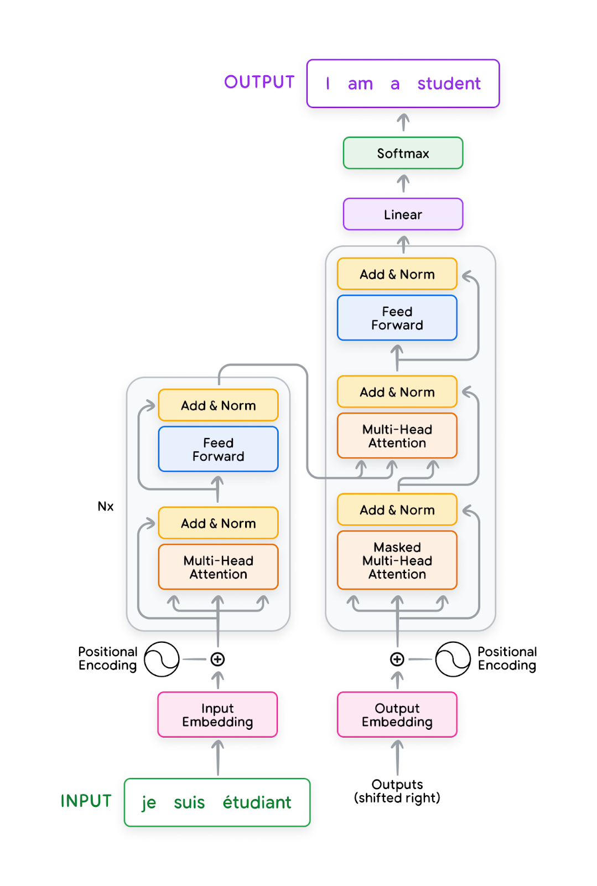
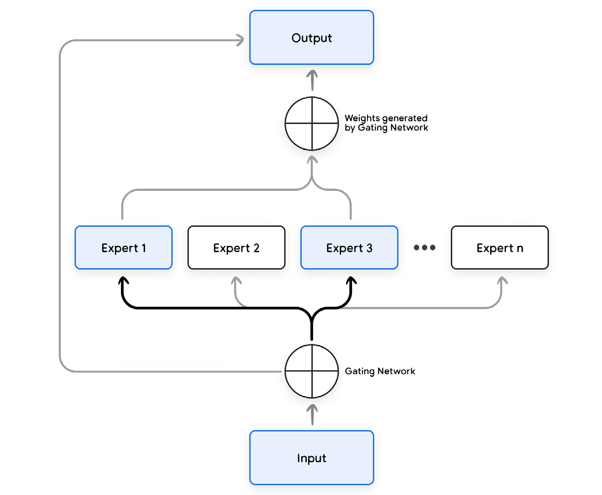
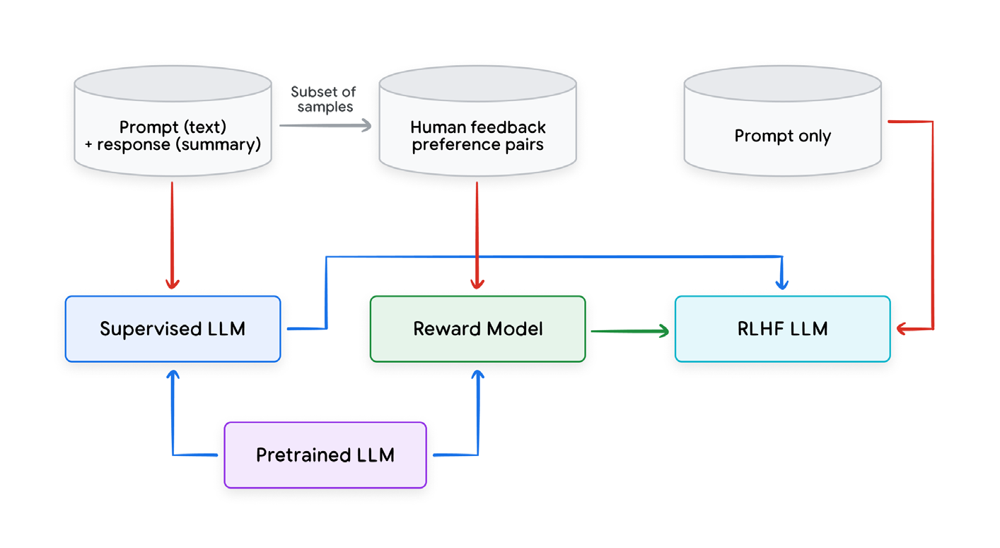

# Introduction:

## LLM - Large Language Model

- **An LLM is an advanced artificial intelligence system that specializes in processing, understanding, and generating human-like text.**
- Trained on massive amount of text data.
- Can perform a variety of tasks such as
	- Machine Translation
	- Creative Text Generation
	- Question Answering
	- Text Summarization
	- Other reasoning and language-oriented tasks

## Importance

- They achieve an **impressive performance boost** from previous state of the art NLP models
- Foundational LLMs perform very well out of the box and displays emergent behaviours.
- Can be adapted to specific tasks through a process called **fine-tuning** which requires significantly less data and computational resources.
- Can be further be guided using **Prompt Engineering.**

## Overview:

- A language model predicts the probability of a sequence of words. Commonly, when given a prefix of text, a language model assigns probabilities to subsequent words.
- Initially, Recurrent Neural Networks (RNNs) were popular for modelling sequences
- RNNs process input and output sequentially and this sequential nature is compute intensive and hard to parallelize.
- RNNs on the positive note have theoretically infinite context length but is not practical due to the **vanishing gradient problem**.
- Transformers are not the most popular approach for modelling sequences.
- They process tokens in parallel by leveraging the self-attention mechanism, hence solving the RNNs parallelization issue.
- Drawback is that the original transformer is that the cost of self-attention is quadratic in the context length which therefore, limits size of context.

# Transformer:

- Developed at Google in 2017 for translation.
- Sequence-to-sequence model capable of converting sequences from one domain into sequences in another domain.

## Original Architecture Overview:

- Encoder
- Decoder

### Input Preparation:

1. **Normalization (Optional):** Standardizes text by removing redundant whitespace,
accents, etc.
1. **Tokenization:** Breaks the sentence into words or subwords and maps them to integer
token IDs from a vocabulary.
1. **Embedding:** Converts each token ID to its corresponding high-dimensional vector,
typically using a lookup table. These can be learned during the training process.
1. **Positional Encoding:** Adds information about the position of each token in the sequence
to help the transformer understand word order.

### Muti-Head Attention (MHA):

- Vector embeddings (obtained from input tokens) are fed to MHA.
- **Self-attention** is a crucial mechanism in transformers; it enables them to focus on specific parts of the input sequence relevant to the task at hand and to capture long-range dependencies within sequences more effectively than traditional RNNs.

- **Self-attention achieves this through the following steps:**

1. **Creating queries, keys, and values:** Each input embedding is multiplied by three learned weight matrices (Wq, Wk, Wv) to generate query (Q), key (K), and value (V) vectors. These are like specialized representations of each word.
	- Query: The query vector helps the model ask, “Which other words in the sequence are relevant to me?”
	- Key: The key vector is like a label that helps the model identify how a word might be relevant to other words in the sequence.
	- Value: The value vector holds the actual word content information.

2. **Calculating scores:** Scores are calculated to determine how much each word should ‘attend’ to other words. This is done by taking the dot product of the query vector of one word with the key vectors of all the words in the sequence.

3. **Normalization:** The scores are divided by the square root of the key vector dimension (dk) for stability, then passed through a SoftMax function to obtain attention weights. These weights indicate how strongly each word is connected to the others.

4. **Weighted values:** Each value vector is multiplied by its corresponding attention weight. The results are summed up, producing a context-aware representation for each word.

In a nutshell, Multi-Head Attention (MHA) uses multiple sets of learnable Q, K, and V weight matrices to project the input into different subspaces. Each set or "head", attends to the input independently and in parallel, allowing the model to capture diverse relationships across the sequence. This parallel structure not only boosts efficiency but also helps the model capture long-range dependencies better than sequential models like RNNs.

### Layer Normalization:

- Layer normalization helps to keep the activity level of each layer at a steady level which results in faster training and much better results in the end.
- Layer normalization computes the mean and variance of the activations to normalize the activations in a given layer.
- This is typically performed to reduce covariate shift as well as improve gradient flow to yield faster convergence during training as well as improved overall performance.

### Residual Connections:

- Residual Connections acts as a shortcut, where input of a layer can bypass everything and added directly to the output.
- Allows network to remember what it learned earlier after going through many layers.
- Residual connections propagate the inputs to the output of one or more layers. 
- This has the effect of making the optimization procedure easier to learn and also helps deal with vanishing and exploding gradients.

### Feedforward layer:

- Output from MHA, Add and Norm layers are fed to feedforward layer
- This layer applies a position-wise transformation to the data, independently for each position in the sequence, which allows the incorporation of additional non-linearity and complexity into the model’s representations. 
- The feedforward layer typically consists of two linear transformations with a non-linear activation function:
	- RELU
	- GELU
- After processing by the feedforward layer, the data undergoes another ‘Add and Norm’ step, which contributes to the stability and effectiveness of deep transformer models.

### Encoder:

- The encoder’s primary function is to process the input sequence into a continuous representation that holds contextual information for each token. 

- Process flow:
	- Sequence normalised, tokenized and converted into embeddings
	- Self-attention mechanism attend dynamically to any other token.
	- Output from encoder is series of embedding vectors Z representing the entire input sequence.

### Decoder:

- The decoder is tasked with generating an output sequence based on the context provided by the encoder’s output Z. It operates

- Two types of attention mechanisms:
	1. **Masked self-attention:** 
		- Masked self-attention ensures that each position can only attend to earlier positions in the output sequence, preserving the auto-regressive property. 
		- This is crucial for preventing the decoder from having access to future tokens in the output sequence. 

	2. **Encoder-Decoder Cross-attention:**
		- The encoder-decoder cross-attention mechanism allows the decoder to focus on relevant parts of the input sequence, utilizing the contextual embeddings generated by the encoder.

### NOTE:
- Majority of recent LLMs adopted a decoder-only variant of transformer architecture. This approach forgoes the traditional encoder-decoder separation, focusing instead on directly generating the output sequence from the input.
- The input follows same process of embedding and positional encoding, then fed to decoder which uses the masked self-attention mechanism.
- This is a streamlined approach simplifying the architecture where encoder and decoder are merged.

### Mixture of Experts (MoE):

A Mixture of Experts (MoE) is a an architecture that combines multiple specialized submodels (the “experts”) to improve overall performance, particularly on complex tasks. It’s a form of **ensemble learning**, but with a key difference: instead of simply aggregating the predictions of all experts, it learns to **route different parts of the input to different experts**. This allows the model to specialize, with each expert becoming proficient in a specific sub-domain or aspect of the data.

Breakdown and flow:
- **Experts:** 
	- Handle a specific subset of the input data or a particular task.
	- Can be any type of model
	- For LLMs, they are usually transformer based models.

- **Gating Network (Router):**
	- Route the input to the appropriate expert(s).
	- Produces probability distribution over experts from input
	- Determines the expert for final prediction
	- Typically a NN

- **Combination Mechanism:** 
	- This combines the outputs of the experts, weighted by the probabilities from the gating network, to produce the final prediction. 
	- A common approach is a weighted average.

# Evolution of Transformers

1. GPT1:
	- OpenAI 2018
	- Decoder only model
	- Trained on BooksCorpus Dataset
2. BERT:
	- Bidirectional Encoder Representations from Transformers
	- Encoder only model
	- BERT focuses on understanding context deeply by training on a masked language model objective. In this setup, random words in a sentence are replaced with a \[MASK] token, and BERT tries to predict the original word based on the surrounding context. 
	- Another innovative aspect of BERT’s training regime is the next sentence prediction loss, where it learns to determine whether a given sentence logically follows a preceding one.
	- Since this is an encoder-only model, BERT cannot generate text.

3. GPT2:
	- Successor of GPT1
	- OpenAI, 2019
	- Scale of up of parameter size and training dataset
	- Trained on WebText (Reddit posts - filtered by Karma rating 3)
	- Learn new task with **Zero-shot learning.**

4. GPT3 Family:
	 - Larger models
	 - Better at few shot learning
	 - Better performance
	 - GPT3 was made available as a commercial API
	 - Instruction-tuning with InstructGPT
	 - Further fine-tuning using **Reinforcement Learning with Human Feedback (RLHF)**
	 - GPT3.5 better at understanding and generating code
	 - GPT4 - Gamechanger model, GPT-4 demonstrates remarkable versatility by solving complex tasks across diverse fields like mathematics, coding, vision, medicine, law, and psychology – all without specialized instructions.

5. LaMDA:
	- Google 2021
	- Language Model for Dialogue Applications

6. Gopher: 
	 - DeepMind 2021
	 - 280 Billion parameter
	 - Dataset trained on: MassiveText
	 - Optimization: Cosine schedule
	
7. GLaM
	- GLaM (Generalist Language Model) was the first sparsely-activated mixture-of-experts language model.
	- GLaM consists of 1.2 trillion parameters but uses only ⅓ of the energy used to train GPT-3 and half of the FLOPs for inference while achieving better overall performance compared to GPT-3.

8. Chinchilla:
	 - DeepMind, 2022
	 - "Bigger is always better" concept
	 -  Size of training data is also crucial.
	
9. PaLM
	 - DeepMind, 2023
	 - Pathways language Model
	 - 540-billion parameter transformer-based large language model developed by Google AI.
	 - One of the key features of PaLM is its ability to scale efficiently.
	
10. PaLM 2:
	- PaLM 2 is even more capable than PaLM, with fewer total parameters.
	- The basis for a number of commercial models Google released as part of Google Cloud Generative AI.

11. Gemini Family:
	- Google 
	- State-of-the-art multimodal language family of models.
	- Built on top of transformer decoders
	- Architectural improvements for optimized inference on Google's Tensor Processing Units (TPU).
	- Multi-query attention for efficiency
	- Mixture of Experts architecture to optimize efficiency and capabilities
	- Gemini Ultra
	- Gemini Pro
	- Gemini Nano - on-device applications
	- Gemini Flash - fastest Gemini model served in the API

12. Gemma:
	- Google AI
	- Open-source
	- Lightweight
	- Gemma 1
	- Gemma 2 - focus on efficiency
	- Gemma 3 - multimodality

13. LLaMa:
	- Meta
	- Open-source
	- Transformer-based models
	- Decoder-only architecture
	- Llama1  - strong performance compared to other open source similar sized models
	- Llama2 - larger context window
	- Llama3 - increased safety to reduce harmful outputs
	- Llama3.2 - multilingual text-only models and vision LLMs, with quantized versions. Uses grouped-query attention and 128K token vocab.
	
14. Mixtral:
	- Mistral AI
	- Sparse Mixture of Experts (SMoE) model
	- While total parameter count is 47B, it utilizes only 13B active parameters per token during inference, leading to faster inference and higher throughput.
	- Open source

15. OpenAI O1:
	- OpenAI
	- complex reasoning abilities honed through reinforcement learning
	- internal “chain-of-thought” process.
	- exceptional performance on challenging scientific reasoning tasks.

16. DeepSeek:
	- Novel reinforcement learning approach, even without relying on extensive labeled data.
	- DeepSeek-R1-Zero model, trained purely with RL.
	- Group Relative Policy Optimization (GRPO) uses a set of predefined rules (assessing coherence, completeness, and fluency) to score the model’s outputs across multiple rounds.
	- Training approach: Multi-stage approach leverages the strengths of each training method: the initial SFT provides a basic linguistic foundation; pure-RL fosters strong reasoning skills; rejection sampling creates high-quality training data; and the final SFT and RL steps ensure a polished, well-rounded model.
	- Model weights are open-sourced but still considered as closed-source due to lack of transparency of training data.

17. Other Open Models:
	- Qwen1.5 - Alibaba
	- Yi - 01.AI
	- Grok 3 - xAI

## Comparison Table:

# Fine-tuning Large Language Models

- **Pre-training** is the foundational stage where an LLM is trained on large, diverse, and unlabelled text datasets where it’s tasked to predict the next token given the previous context.
- Further specialized via **fine-tuning**

## Supervised fine-tuning

SFT involves training an LLM on a set of task-specific demonstration datasets where its performance is also measured across a set of domain-specific tasks.

1. **Instruction-tuning/instruction following:** The LLM is provided as input an instruction to follow which might include summarizing a piece of text, writing a piece of code, or writing a poem in a certain style
2. **Dialogue-tuning:** This is a special case of instruction tuning where the LLM is fine-tuned on conversational data in the form of questions and responses. This is often called multi-turn dialogue.
3. **Safety tuning:** This is crucial for mitigating risks associated with bias, discrimination, and toxic outputs. It involves a multi-pronged approach encompassing careful data selection, human-in-the-loop validation, and incorporating safety guardrails. Techniques like reinforcement learning with human feedback (RLHF)40 enable the LLM to prioritize safe and ethical responses.

## Reinforcement learning from human feedback (RLHF)

- Second stage fine-tuning after SFT
- This is a very powerful fine-tuning technique that enables an LLM to better align with human-preferred responses.
- A reward model is used for this.
- An RM is usually initialized with a pretrained transformer model, often also one that is SFT. Then it is tuned on human preference data which is either single sided (with a prompt, response and a score) or composed of a prompt and a pair of responses along with a preference label indicating which of the two responses was preferred.
- Once an RM has been trained, it’s then used by a Reinforcement Learning (RL) policy gradient algorithm, which further finetunes a previously instruction-tuned LLM to generate responses that are better aligned with human preferences.
- To better scale RLHF, **RL from AI Feedback (RLAIF)** leverages AI feedback instead of human feedback to generate preference labels.
- Remove the need for training RLHF by leveraging approaches such as **direct preference optimization (DPO).**

## Parameter Efficient Fine-Tuning (PEFT)

- Faster and cheaper with small adjustments
- PEFT approaches append a significantly smaller set of weights (e.g., on the order of thousands of parameters) that are used to ‘perturb’ the pre-trained LLM weights.
- This has the benefit of training a significantly smaller set of weights, compared to traditional fine-tuning of the entire model.

### Common PEFT Techniques:

1. **Adapter-based fine-tuning** employs small modules, called adapters, to the pretrained model. Only the adapter parameters are trained, resulting in significantly fewer parameters than traditional SFT.
2. **Low-Rank Adaptation (LoRA)** tackles efficiency differently. It uses two smaller matrices to approximate the original weight matrix update instead of fine-tuning the whole LLM. This technique freezes the original weights and trains these update matrices, significantly reducing resource requirements with minimum additional inference latency. (QLoRA uses quantized weights for greater efficiency)
3. **Soft prompting** is a technique for conditioning frozen large language models with learnable vectors instead of hand-crafted text prompts. These vectors, called soft prompts, are optimized on the training data and can be as few as five tokens, making them parameter-efficient and enabling mixed-task inference.

# Using Efficiently the LLMs

## 1. Prompt engineering

- **Zero-shot prompting** - provide the LLM directly with a prompt with instructions and the LLM relies heavily on its existing knowledge to output the correct response.
- Few-shot prompting - provide the LLM with a task description, as well as a few (e.g. three to five) carefully chosen examples, that will help guide the LLM’s response.
- **Chain-of-thought (CoT) prompting** - Rather than simply asking the LLM a question, you provide a prompt that demonstrates how to solve similar problems using step-by-step reasoning. LLM then generates its own chain of thought for the new problem, breaking it down into smaller steps and explaining its reasoning. Finally, it provides an answer based on its reasoning process.

## 2. Sampling Techniques and Parameters

Sampling techniques can be employed to determine how the model chooses
the next token in a sequence.

- **Greedy search:** Selects the token with the highest probability at each step. This is the simplest option but it can lead to repetitive and predictable outputs.
- **Random sampling:** Selects the next token according to the probability distribution, where each token is sampled proportionally to its predicted probability. This can produce more surprising and creative text, but also a higher chance of nonsensical output. 
- **Temperature sampling:** Adjusts the probability distribution by a temperature parameter. Higher temperatures promote diversity, lower temperatures favor high-probability tokens.
- **Top-K sampling:** Randomly samples from the top K most probable tokens. The value of K controls the degree of randomness. 
- **Top-P sampling (nucleus sampling):** Samples from a dynamic subset of tokens whose cumulative probability adds up to P. This allows the model to adapt the number of potential candidates depending on its confidence, favoring more diversity when uncertain and focusing on a smaller set of highly probable words when confident.
- **Best-of-N sampling:** Generates N separate responses and selects the one deemed best according to a predetermined metric (e.g., a reward model or a logical consistency check). This is particularly useful for short snippets or situations where logic and reasoning are key.

## 3. Task-based Evaluation

A tailored evaluation framework is essential for navigating LLM application development by validating functionality and user experience, identifying potential issues, facilitating communication about capabilities, and establishing a roadmap for improvement.

LLMs are evaluated using 3 methods:

- **Traditional Evaluation Methods** - quantitative metrics (may penalize creative or unexpected outputs)
- **Human Evaluation** - gold standard
- **LLM- Powered Autoraters** - LLM-powered autoraters try to mimic human judgment, offering scalable and efficient evaluations.

# Accelerating inference

Two of the main resources used by LLMs are memory and computation. Techniques for
improving the efficiency or speed of inference focus primarily on these resources

Consider aspects of trade offs:

- The Quality vs Latency/Cost Tradeoff:  It is possible to improve the speed and cost of inference significantly through accepting what might be marginal to negligible drops in the model’s accuracy.
- The Latency vs Cost Tradeoff: Balancing latency and cost intentionally is key to making sure we tailor LLM performance to the product or use case it’s being used in.

## Methods:

## Output-approximating methods

### Quantization:

- Quantization is the process of decreasing the numerical precision in which weights and activations are stored, transferred and operated upon.

- The default representation of weights and activations is usually 32 bits floating numbers, with quantization we can drop the precision to 8 or even 4 bit integers.

- Quantisation Aware Training (QAT) is quantization incorporated into the training and is generally considered to be a more resilient approach as the model is able to recover some of the quantisation-related quality losses during training.

### Distillation:

- Distillation is a set of training techniques that targets improving the quality of a smaller model (the student) using a larger model (the teacher).
- Prominent Techniques: 
	- Knowledge Distillation
	- Data Distillation
	- On-policy Distillation

## Output-preserving methods

### Flash Attention:

It optimizes the attention calculation by making the attention algorithm IO Aware, particularly trying to minimize the amount of data we move between the slow HBM (high bandwidth memory) to the faster memory tier (SRAM/VMEM) in TPUs and GPUs.

### Prefix Caching:

Prefix Caching refers to the process of caching the KV Cache itself between subsequent inference requests in order to reduce the latency and cost of the prefill operation.

### Speculative Decoding

The main idea is to use a much smaller secondary model (often referred to as the drafter) to run ahead of the main model and predict more tokens. (e.g. 4 tokens ahead). This will happen very quickly as the drafter is much faster and smaller than the main model.

We then use the main model to verify the hypotheses of the drafter in parallel for each of the 4 steps (i.e. the first token, the first two tokens, the first 3 tokens and finally all 4 tokens), and we then select the accepted hypothesis with the maximum number of tokens.

### Batching and Parallelization

- Batching less compute-intensive operations (i.e. we can run multiple requests on the same hardware simultaneously to better utilize the spare compute)
- Parallelizing the more compute intensive parts of the computations (i.e. we can divide the computation and split it amongst more hardware instances to get more compute capacity and therefore better latencies)

# Applications:

1. Code and mathematics
2. Machine translation
3. Text summarization
4. Q-A systems
5. Chatbots
6. Content creation
7. Natural Language Inference
8. Text Classification
9. Text Analysis
10. Multimodal applications