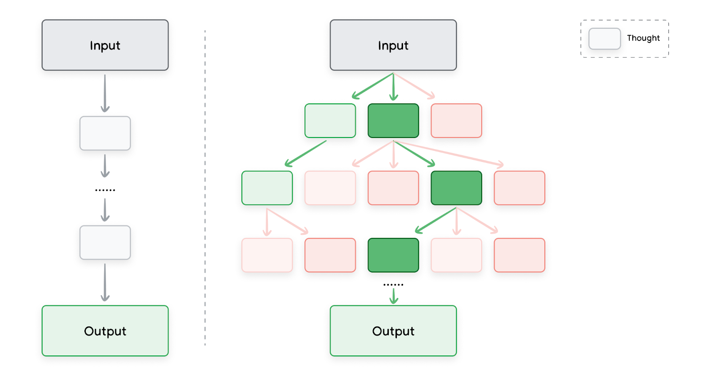

# Definition:

- Prompt engineering is the process of designing high-quality prompts that guide LLMs to produce accurate outputs.

- This process involves tinkering to find the best prompt, optimizing prompt length, and evaluating a prompt’s writing style and structure in relation to the task. In the context of natural language processing and LLMs, a prompt is an input provided to the model to generate a response or prediction

# LLM output configuration

## Output length

- Generating more tokens requires more computation from the LLM, leading to higher energy consumption, potentially slower response times, and higher costs.

- Output length restriction is especially important for some LLM prompting techniques, like ReAct, where the LLM will keep emitting useless tokens after the response you want.

## Sampling controls

- LLMs predict probabilities for what the next token could be, with each token in the LLM’s vocabulary getting a probability. 
- Common settings include
	- Temperature
	- top-K
	- top-P

## Temperature

- Temperature controls the degree of randomness in token selection. 
- Lower temperatures are good for prompts that expect a more deterministic response, while higher temperatures can lead to more diverse or unexpected results.
- Low temperature (0, greedy decoding) is deterministic. (precise and standard outputs)
- High temperature (1, default temperature) is more random. (more creative and random outputs)

## Top-K and Top-P

Top-K and top-P (also known as nucleus sampling) are two sampling settings used in LLMs
to restrict the predicted next token to come from tokens with the top predicted probabilities.

Top-K:

- Top-K sampling selects the top K most likely tokens from the model’s predicted distribution.
- Higher K means more variety in the output and a lower K means more focused output.
- K=1 is equivalent to greedy decoding.

Top-P:

- Top-P sampling selects the top tokens whose cumulative probability does not exceed a certain value (P).
- Values for P range from 0 (greedy decoding) to 1 (all tokens in the LLM’s vocabulary).

## Putting all together

1. If all three settings are available, the process flow is as follows:

	- top-K and top-P are candidates for selecting the next tokens
	- Temperature is then applied to the output of tokens from top-K and top-P

2. If only one type of top setting is available, the process flow stays the same with only the available top being used.

3. If temperature is not available,  output from top-K and top-P are randomly selected.

> General starting point:

> Coherent results with some creativity:
> 	- Temp: 0.2
> 	- top-P: 0.95
> 	- top-K: 30
> 
> Creative results:
> 	- Temp: 0.9
> 	- top-P: 0.99
> 	- top-K: 40
> 
> Less creative results:
> 	- Temp: 0.1
> 	- top-P: 0.9
> 	- top-K: 20
> 
> Single correct answer (math problems):
> 	- Temp: 0

# Prompting Techniques

## General prompting / zero shot

A zero-shot prompt is the simplest type of prompt. It only provides a description of a task and some text for the LLM to get started with. This input could be anything: a question, a start of a story, or instructions. The name zero-shot stands for ’no examples’.

## One-shot & few-shot

- A **one-shot prompt**, provides a single example, hence the name one-shot. The idea is the model has an example it can imitate to best complete the task.
- A few-shot prompt provides multiple examples to the model. This approach shows the model a pattern that it needs to follow. The idea is similar to one-shot, but multiple examples of the desired pattern increases the chance the model follows the pattern.
- Note: One small mistake can confuse the model and will result in undesired output.

## System, contextual and role prompting

- **System prompting** sets the overall context and purpose for the language model. It defines the ‘big picture’ of what the model should be doing, like translating a language, classifying a review etc
- **Contextual prompting** provides specific details or background information relevant to the current conversation or task. It helps the model to understand the nuances of what’s being asked and tailor the response accordingly.
- **Role prompting** assigns a specific character or identity for the language model to adopt. This helps the model generate responses that are consistent with the assigned role and its associated knowledge and behavior.

## Step-back prompting

Step-back prompting is a technique for improving the performance by prompting the LLM to first consider a general question related to the specific task at hand, and then feeding the answer to that general question into a subsequent prompt for the specific task. This ‘step back’ allows the LLM to activate relevant background knowledge and reasoning processes before attempting to solve the specific problem.

## Chain of Thought (CoT)

Chain of Thought (CoT) prompting is a technique for improving the reasoning capabilities
of LLMs by generating intermediate reasoning steps.

Advantages:
- low-effort, effective approach (no need for fine-tuning)
- interpretability with CoT prompting, as you can learn from the LLM’s responses and see the reasoning steps
- improve robustness when moving between different LLM versions

Disadvantages:
- more output tokens, which predictions cost more money and take longer.

## Self-consistency

Self-consistency combines sampling and majority voting to generate diverse reasoning paths and select the most consistent answer. It improves the accuracy and coherence of responses generated by LLMs.

It follows the following steps:
1. Generating diverse reasoning paths: The LLM is provided with the same prompt multiple times. A high temperature setting encourages the model to generate different reasoning paths and perspectives on the problem.
2. Extract the answer from each generated response.
3. Choose the most common answer.

## Tree of Thoughts (ToT)

It generalizes the concept of CoT prompting because it allows LLMs to explore multiple different reasoning paths simultaneously, rather than just following a single linear chain of thought.

- Useful and suited for complex tasks that require exploration.

## ReAct (reason & act)

Reason and act (ReAct) prompting is a paradigm for enabling LLMs to solve complex tasks using natural language reasoning combined with external tools (search, code interpreter etc.) allowing the LLM to perform certain actions, such as interacting with external APIs to retrieve information which is a first step towards agent modeling.

## Automatic Prompt Engineering (APE)

- Prompt a model to generate more prompts. Evaluate them, possibly alter the good ones. And repeat.

## Code prompting

- Prompts for writing code
- Prompts for explaining code
- Prompts for translating code
- Prompts for debugging and reviewing code

## Multimodal prompting

Multimodal prompting is a separate concern, it refers to a technique where you use multiple input formats to guide a large language model, instead of just relying on text. This can include combinations of text, images, audio, code, or even other formats, depending on the model’s capabilities and the task at hand.

# Best Practices

1. Provide examples
2. Design with simplicity
3. Be specific about the output
4. Use Instructions over Constraints
5. Control the max token length
6. Use variables in prompts
7. Experiment with input formats and writing styles
8. For few-shot prompting with classification tasks, mix up the classes
9. Adapt to model updates
10. Experiment with output formats (JSON, XML)
11. JSON Repair: This library intelligently attempts to automatically fix incomplete or malformed JSON objects, making it a crucial ally when working with LLM-generated JSON, especially when dealing with potential truncation issues.
12. Working with Schemas: A JSON Schema defines the expected structure and data types of your JSON input. By providing a schema, you give the LLM a clear blueprint of the data it should expect, helping it focus its attention on the relevant information and reducing the risk of misinterpreting the input.
13. Experiment together with other prompt engineers
14. CoT Best practices: Set temp to 0
15. Document the various prompt attempts