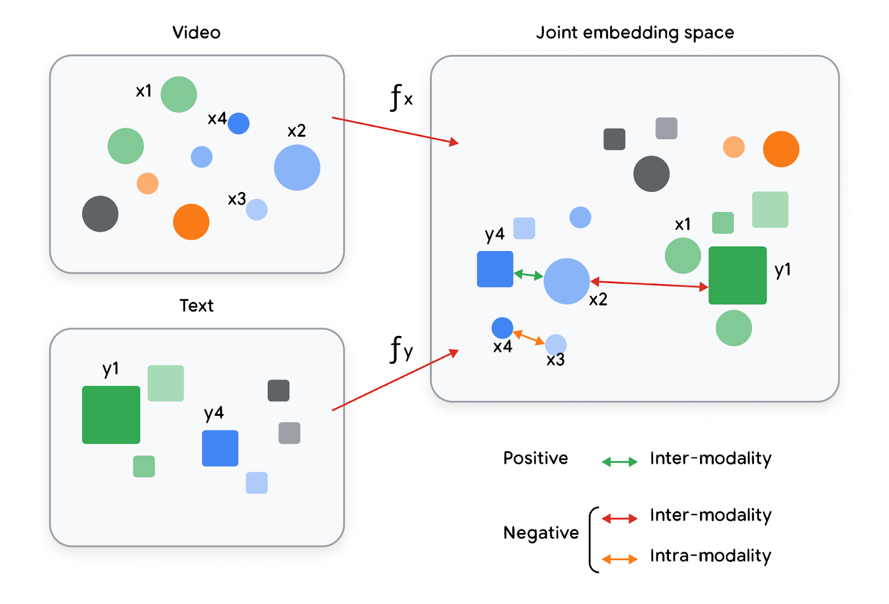
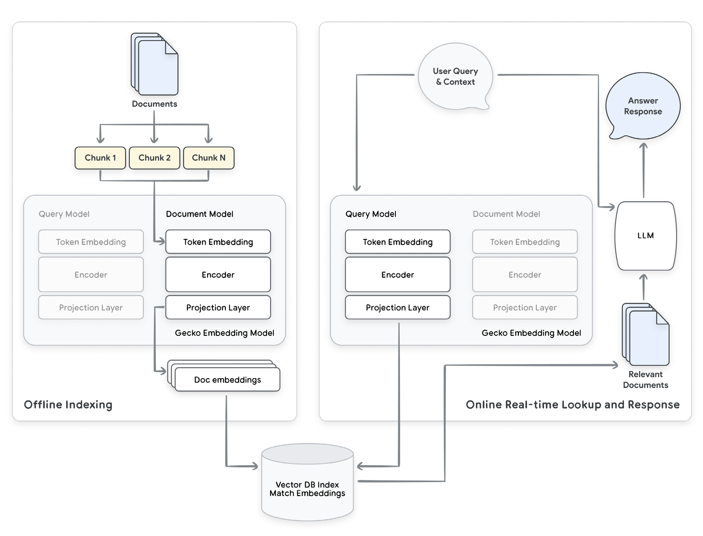
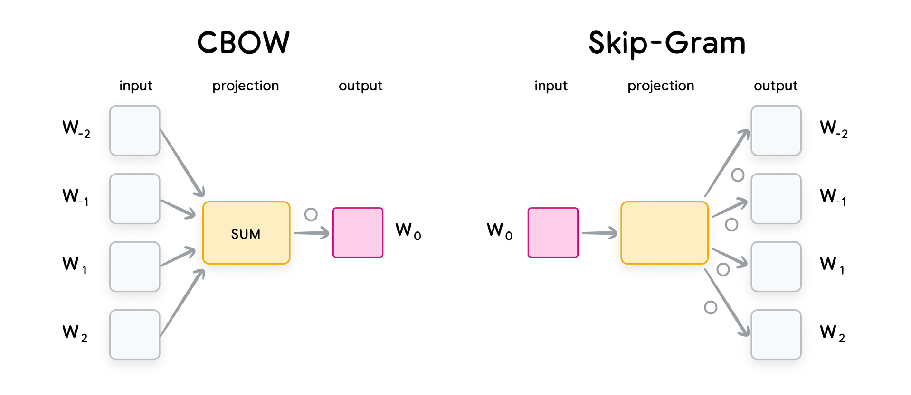
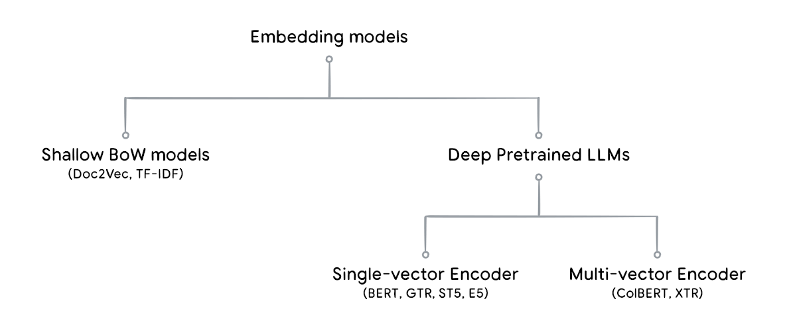
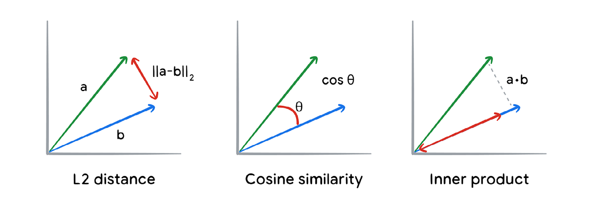

# Embeddings:

- Embeddings are numerical representations of real-world data such as text, speech, image, or videos.
- The name embeddings refers to a similar concept in mathematics where one space can be mapped, or embedded, into another space.
- **Embeddings are expressed as low-dimensional vectors where the geometric distance between two vectors in the vector space is a projection of the relationship and semantic similarity between the two real-world objects that the vectors represent.**
- They provide compact representations of data of different types, while simultaneously also allowing you to compare two different data objects and tell how similar or different they are on a numerical scale.
- Help in efficient largescale data processing and storage by acting as means of lossy compression of the original data while retaining its important semantic properties.

## Embedding in world of multimodality

- Joint embeddings are when multiple types of objects are being mapped into the same embeddings space, for example retrieving videos based on text queries.
- These embedding representations are designed to capture as much of the original object’s characteristics as possible.

## Evaluating Embedding Quality

Two important metrics for evaluating quality:

1. Precision - all documents retrieved should be relevant
2. Recall - all of the relevant documents should be retrieved
3. Precision at K (for only top k results)
4. Recall at K (for only top k results)
5. Normalized Discounted Cumulative Gain (nDCG) - use when order of results matter - the quality of the ranking produced by the embedding model compared to the desired ranking. (A top result on google page 2 is not actually relevant)

$$DCG= \sum_{i=1}^{P} \frac{rel_i}{log_2(i+1)} , \quad \text{where }p \text{ is position and } rel_i \text{ is the relevance score}$$

## Search Example

### Retrieval Augmented Generation (RAG)

Two main processes:

1. Index creation where documents are divided into chunks which are used to generate embeddings and stored in a vector database for low latency searches.
2. When the user asks a question to the system that is embedded using the query portion of the model and which will map to relevant documents when using a similarity search in the vector database.

## Types of Embeddings

### Text Embedding

- Used extensively for NLP
- Embed meaning of natural language
- Two broad categories:
	- Token/word
	- Document

#### Lifecycle:

- Text: Input string
- Tokenization: Input string is split into smaller meaningful pieces called tokens.
- Indexing: Each of these tokens is then assigned a unique integer value usually in the range: \[0, cardinality of the total number of tokens in the corpus].
- Embedding: The output this indexing is called embedding.

### Word Embedding

Common word embeddings:
1. GloVe
2. SWIVEL
3. Word2Vec

#### Word2Vec

Word2Vec is a family of model architectures that operates on the principle of “the semantic meaning of a word is defined by its neighbors”, or words that frequently appear close to each other in the training corpus.

Types of Word2Vec Architectures:

1. Continuous bag of words (CBOW): Tries to predict the middle word, using the embeddings of the surrounding words as input. (faster to train, suitable for bigger datasets)
2. Skip-gram: The setup is inverse of that of CBOW, with the middle word being used to predict the surrounding words within a certain range. (slower to train, suitable for smaller datasets)

- FastText is an extention of word2vec by going into sub-word level.

- Cons of word2vec: does not capture global statistics (words in whole corpus)

#### GloVe

GloVe is a word embedding technique that leverages both global and local statistics of words.

Process:

- Create a co-occurrence matrix for representing the relationships between words.
- Factorization technique to learn those representations from the matrix.
- Result of the factorization captures both global and local information.

#### Swivel

- SWIVEL is another approach which leverages the co-occurrence matrix to learn word - embeddings. 
- SWIVEL stands for Skip-Window Vectors with Negative Sampling.

Process:
- uses local windows to learn word vectors from the co-occurrence matrix
- SWIVEL also considers unobserved co-occurrences and handles it using a special piecewise loss, boosting its performance with rare words.
- Less accurate than GloVe but faster to train.

### Document Embedding

Document Embeddings is about representing large chunks of text or documents.

Two categorized stages:
- Bag-of-words (BoW)
- Deeper trained LLMs

#### Bag of Words

- Latent semantic analysis (LSA) uses a co-occurrence matrix of words in documents.
- Latent dirichlet allocation (LDA) uses a bayesian network to model the document embeddings.
- TF-IDF (term frequency-inverse document frequency) based models, which are statistical models that use the word frequency to represent the document embedding.

**Drawback:** 1. Word ordering and 2. Semantic meanings are ignored.

**Solution:** Doc2Vec model adds an additional ‘paragraph’ embedding or, in other words, document embedding in the model of Word2Vec. The paragraph embedding is concatenated or averaged with other word embeddings to predict a random word in the paragraph.

#### Deeper pretrained large language models

- BERT - bidirectional encoder representations from transformers was proposed with groundbreaking results on 11 NLP tasks in 2018
- PaLM
- Gemini
- GPT
- Llama
- GTR
- Sentence-T5
- Matryoshka Embeddings

>Although the deep neural network models require a lot more data and compute time to train, they have much better performance compared to models using bag-of-words paradigms.

### Image and Multimodal Embeddings

**Unimodal Embedding** - Training a CNN or Vision Transformer model on a large scale image classification task (for example, Imagenet), and then using the penultimate layer as the image embedding.

**Multimodal Embedding** - take the individual unimodal text and image embeddings and create the joint embedding of their semantic relationships learnt via another training process.

### Structured data embeddings

- Structured data refers to data has a defined schema, like an table in a database where individual fields have known types and definitions.

- We have to create the embedding model for the structured data since it would be specific to a particular application.

#### General Structured Data

- Done using ML models in the dimensionality reduction category, such as the PCA model
- Use case 1: anomaly detection
- Use case 2: Downstream ML task such as classification

#### User/item Structured Data

- The input is no longer a general structured data table as above.
- This category is for recommendation purposes, as it maps two sets of data (user dataset, item/product/etc dataset) into the same embedding space.

### Graph Embeddings

- Graph embeddings are another embedding technique that lets you represent not only information about a specific object but also its neighbors (namely, their graph representation).

- Popular algorithms for graph embedding include DeepWalk, Node2vec, LINE, and GraphSAGE.

### Training Embeddings

- Embedding models use dual encoder (two tower) architecture.
- For example, for the text embedding model used in question-answering, one tower is used to encode the queries and the other tower is used to encode the documents.
- The loss used in embedding models training is usually a variation of contrastive loss, which takes a tuple of <inputs, positive targets, \[optional] negative targets> as the inputs. Training with contrastive loss brings positive examples closer and negative examples far apart.
- Training includes two stages: pretraining (unsupervised learning) and fine tuning (supervised learning).
- Pre-training can be skipped by leveraging already pre-trained foundational model such as BERT, T5, GPT, Gemini and CoCa.
- Fine-tuning is done is one or several phases: various methods, including human labelling, synthetic dataset generation, model distillation, and hard negative mining.

# Vector Search

- It uses the vector or embedded semantic representation of documents.
- As vector search works on any sort of embedding it also allows search on images, videos, and other data types in addition to text.
- Vector search lets you to go beyond searching for exact query literals and allows you to search for the meaning across various data modalities.

Process Flow:

- Compute embeddings using a function for items of interests.
- Store embeddings in a database.
- Embed incoming query in same vector space of items of interests.
- Find best matches to the query based on metrics:
	- Euclidean Distance (L2 distance) - best for low dimensional data
	- Cosine similarity
	- Inner product - better for high dimensional data

## Vector Search Algorithms

- Straightforward approach for searching best matches - linear search, however this is unacceptably slow with runtime $O(N)$.
- ANN is more practical.
- ANN is a technique for finding the closest points to a given point in a dataset with a small margin of error - but with far less computations required as the search space is greatly reduced to $O(\log{N})$.

> Other approaches listed below:

### Locality Sensitive hashing and Trees

Locality sensitive hashing (LSH) is a technique for finding similar items in a large dataset. It does this by creating one or more hash functions that map similar items to the same hash bucket with high probability.

Another intuitive way to think about LSH is grouping residences by their postal code or neighborhood name. Then based on where someone chooses to move you look at the residences for only that neighborhood and find the closest match.

**Trees: Kd-tree** approach works by creating the decision boundaries by computing the median of the values of the first dimension, then that of the second dimension and so on. This approach is very much like a decision tree. (Ineffective for high dimensional vectors)

**Ball-tree** algorithm is better suited. It is similar in functionality, except instead of going by dimension-wise medians it creates buckets based on the radial distance of the data points from the center.

### Hierarchical navigable small worlds

One of the FAISS (Facebook AI similarity search) implementations leverages the concept of hierarchical navigable small world (HNSW) to perform vector similarity search in sublinear $(O(\log{n}))$ runtime with a good degree of accuracy.

- Go to library
- Solid Performer

### ScaNN - SCalable approximate Nearest Neighbor

- By Google
- Available on Google Cloud

Process flow:

1. The first step is the optional partitioning step during training (optional for small dataset and crucial for large datasets)
2. The space pruning is configured through the number of partitions and the number of partitions to search. A larger number leads to better recall but larger partition creation time. A good heuristic is to set the number of partitions to be the square root of the number of vectors.
3. At query time ScaNN uses the user-specified distance measure to select the specified number of top partitions (a value specified by the user), and then executes the scoring step next.
4. ScaNN compares the query with all the points in the top partitions and selects the top K’. This distance computation can be configured as exact distance or approximate distance.
5. User can optionally choose to rescore the user specified top K number of results more accurately.

# Vector Databases

Vector embeddings embody semantic meanings of data, while vector search algorithms provide a means for efficiently querying them.

Some examples:

1. Google Cloud’s Vertex Vector Search
2. Google Cloud’s AlloyDB & Cloud SQL Postgres ElasticSearch
3. Pinecone

## Operational Considerations

Challenges:

1. Firstly, embeddings, unlike traditional content, can mutate over time. This means that the same text, image, video or other content could and should be embedded using different embedding models to optimize for the performance of the downstream applications. However, frequently updating the embeddings - especially those trained on large amounts of data - can be prohibitively expensive. Consequently, a balance needs to be struck.
2. While embeddings are great at representing semantic information, sometimes they can be suboptimal at representing literal or syntactic information. You can overcome this challenge by using a combination of full-text search to pre-filter or post-filter the search space before passing it onto the semantic search module.
3. An important point to consider is that depending on the nature of the workload in which the semantic query occurs, it might be worth relying on different vector databases.

# Applications

| Task                     | Description                                                                                                                                                                                                                    |
| ------------------------ | ------------------------------------------------------------------------------------------------------------------------------------------------------------------------------------------------------------------------------ |
| Retrieval                | Given a query and a set of objects (for example, documents, images, and videos), retrieve the most relevant objects. Based on the definition of relevant objects, the subtasks include question answering and recommendations. |
| Semantic text similarity | Determine whether two sentences have the same semantic meaning. The subtasks include: paraphrasing, duplicate detection, and bitext mining.                                                                                    |
| Classification           | Classify objects into possible categories. Based on the number of labels, the subtasks include binary classification, multi-class classification, and multilabel classifications.                                              |
| Clustering               | Cluster similar objects together.                                                                                                                                                                                              |
| Reranking                | Rerank a set of objects based on a certain query.                                                                                                                                                                              |
