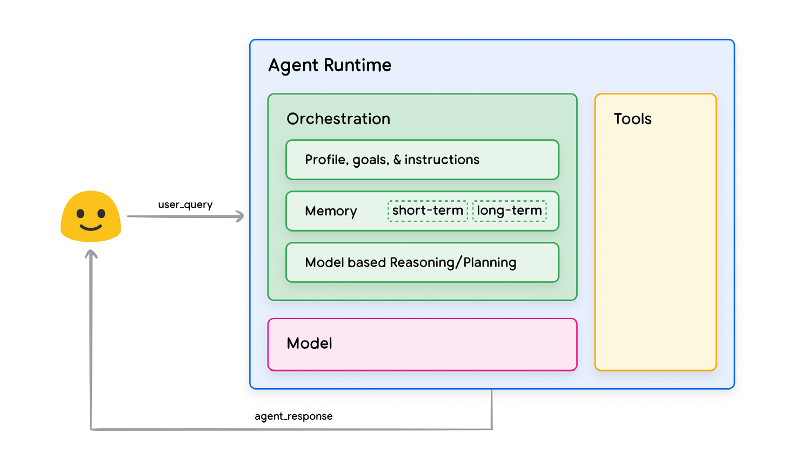
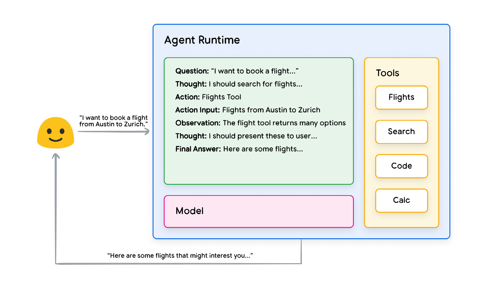
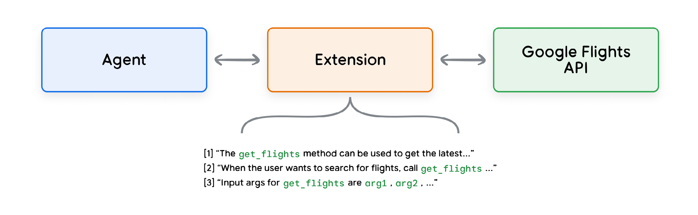
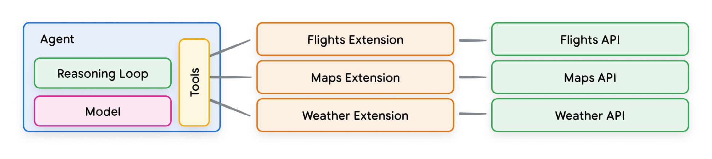
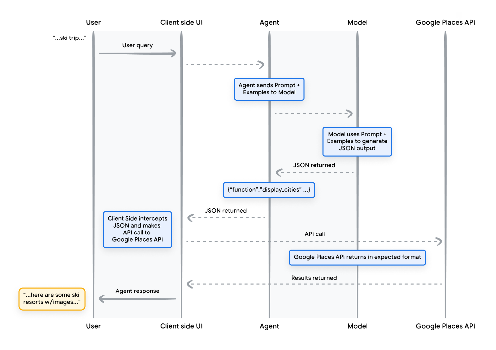
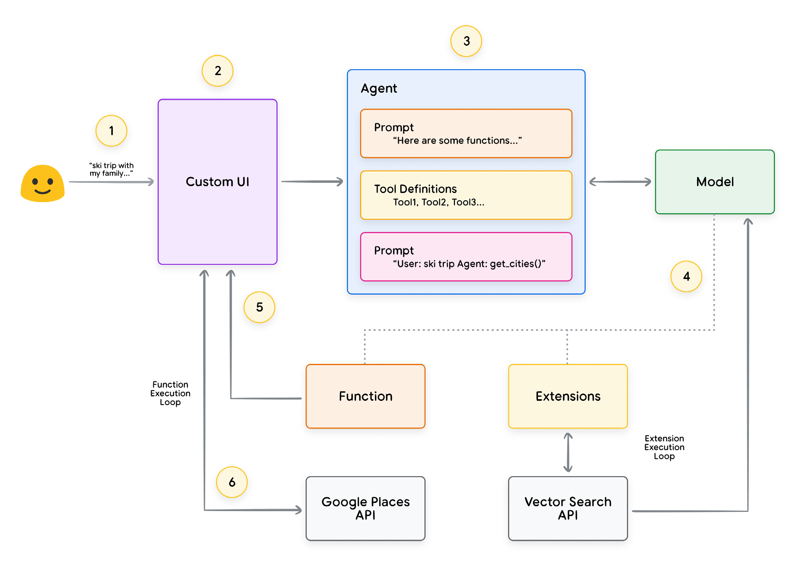

# Introduction

Generative AI models can be trained to use tools to access real-time information or suggest a real world action. For example, a model can leverage a database retrieval tool to access specific information, like a customer's purchase history, so it can generate tailored shopping recommendations. This combination of reasoning, logic, and access to external information
that are all connected to a Generative AI model invokes the concept of an agent, or a program that extends beyond the standalone capabilities of a Generative AI model.

# What is an Agent ?

- A Generative AI agent can be defined as an application that attempts to achieve a goal by observing the world and acting upon it using the tools that it has at its disposal.
- Agents are autonomous and can act independently of human intervention, especially when provided with proper goals or objectives they are meant to achieve.

## Components

### The model

- A model refers to the language model (LM) that will be utilized as the centralized decision maker for agent processes.

- The model used by an agent can be one or multiple LM’s of any size (small / large) that are capable of following instruction based reasoning and logic frameworks, like ReAct, Chain-of-Thought, or Tree-of-Thoughts.

- The model is said to be the brain of the agent.

### The tools

- Foundational models are constrained by their inability to interact with the outside world.
- Tools bridge this gap, empowering agents to interact with external data and services while unlocking a wider range of actions beyond that of the underlying model alone.
- With tools, agents can access and process real-world information.
- The tools are said to be the hands of the agent.

### The orchestration layer

The orchestration layer describes a **cyclical process** that governs how the agent takes in information, performs some internal reasoning, and uses that reasoning to inform its next action or decision.

## Agents vs. Models

| Models                                                                                                                                                                                   | Agents                                                                                                                                                                                                                                                                                                                   |
| ---------------------------------------------------------------------------------------------------------------------------------------------------------------------------------------- | ------------------------------------------------------------------------------------------------------------------------------------------------------------------------------------------------------------------------------------------------------------------------------------------------------------------------ |
| Knowledge is limited to what is available in their training data.                                                                                                                        | Knowledge is extended through the connection with external systems via tools                                                                                                                                                                                                                                             |
| Single inference / prediction based on the user query. Unless explicitly implemented for the model, there is no management of session history or continuous context. (i.e. chat history) | Managed session history (i.e. chat history) to allow for multi turn inference / prediction based on user queries and decisions made in the orchestration layer. In this context, a ‘turn’ is defined as an interaction between the interacting system and the agent. (i.e. 1 incoming event/ query and 1 agent response) |
| No native tool implementation.                                                                                                                                                           | Tools are natively implemented in agent architecture.                                                                                                                                                                                                                                                                    |
| No native logic layer implemented. Users can form prompts as simple questions or use reasoning frameworks (CoT, ReAct, etc.) to form complex prompts to guide the model in prediction.   | Native cognitive architecture that uses reasoning frameworks like CoT, ReAct, or other pre-built agent frameworks like LangChain.                                                                                                                                                                                        |

## Cognitive Architecture

- Agents can use cognitive architectures to reach their end goals by iteratively processing information, making informed decisions, and refining next actions based on previous outputs.
- At the core of agent cognitive architectures lies the orchestration layer, responsible for maintaining memory, state, reasoning and planning.
- It uses the rapidly evolving field of prompt engineering and associated frameworks to guide reasoning and planning, enabling the agent to interact more effectively with its environment and complete tasks.

### Popular Frameworks for prompt engineering:

1. **ReAct**, a prompt engineering framework that provides a thought process strategy for language models to Reason and take action on a user query, with or without in-context examples.
2. **Chain-of-Thought (CoT)**, a prompt engineering framework that enables reasoning capabilities through intermediate steps.
3. **Tree-of-thoughts (ToT)**, a prompt engineering framework that is well suited for exploration or strategic lookahead tasks

### ReAct Framework:

1. User sends query to the agent
2. Agent begins the ReAct sequence
3. The agent provides a prompt to the model, asking it to generate one of the next ReAct steps and its corresponding output: 
	a. Question: The input question from the user query, provided with the prompt
	b. Thought: The model’s thoughts about what it should do next
	c. Action: The model’s decision on what action to take next
		i. This is where tool choice can occur
		ii. For example, an action could be one of \[Flights, Search, Code, None], where the first 3 represent a known tool that the model can choose, and the last represents “no tool choice”
	d. Action input: The model’s decision on what inputs to provide to the tool (if any)
	e. Observation: The result of the action / action input sequence
		i. This thought / action / action input / observation could repeat N-times as needed
	f. Final answer: The model’s final answer to provide to the original user query
4. The ReAct loop concludes and a final answer is provided back to the user

# Tools: Our Keys to the Outside World

- LLMs lack the ability to perceive and influence the real world.
- As good as it what it has learned from its training data.
- To interact with outside world: Functions, Extensions and Data Stores.
- These allow the LLMs to link to external systems and data, allowing the agent to perform a wider variety of tasks to do more with more accuracy and reliability.

## Extensions

Extensions bridge the gap between an API and an agent in a standardized way, allowing agents to seamlessly execute APIs regardless of their underlying implementation.

An Extension bridges the gap between an agent and an API by:
1. Teaching the agent how to use the API endpoint using examples.
2. Teaching the agent what arguments or parameters are needed to successfully call the API endpoint.

Sample Extension to external APIs:

1 to many relationship between agents, extensions and APIs:

## Functions

- Functions are defined as self-contained modules of code that accomplish a specific task and can be reused as needed.
- Functions work very similarly in the world of agents, but we can replace the software developer with a model.
- A model can take a set of known functions and decide when to use each Function and what arguments the Function needs based on its specification.

Differences from Extensions:

1. A model outputs a Function and its arguments, but doesn’t make a live API call.
2. Functions are executed on the client-side, while Extensions are executed on the agent-side.

Example of a function call:

In summary, functions offer a straightforward framework that empowers application developers with fine-grained control over data flow and system execution, while effectively leveraging the agent/model for critical input generation.

## Data Stores

Data Stores allow developers to provide additional data in its original format to an agent, eliminating the need for time-consuming data transformations, model retraining, or finetuning.

The Data Store converts the incoming document into a set of vector database embeddings that the agent can use to extract the information it needs to supplement its next action or response to the user.

In GenAI, Data Stores are typically implemented as a vector database that the developer wants the agent to have access to at runtime.

Most common example is the use of  Vector Database in RAG applications.

# Enhancing model performance with targeted learning

Approaches:
- In-context learning: Fast but not effective for complex tasks
- Retrieval-based in-context learning: RAG based architectures
- Fine-tuning based learning: High cost but effective for complex tasks

# Production applications with Vertex AI Agents

- Google’s Vertex AI platform simplifies this process by offering a fully managed environment with all the fundamental elements covered earlier. 

- Using a natural language interface, developers can rapidly define crucial elements of their agents - goals, task instructions, tools, sub-agents for task delegation, and examples - to easily construct the desired system behavior. 

Sample end-to-end agent architecture on Vertex AI platform:

>Note: It’s important to remember that building complex agent architectures demands an iterative approach. Experimentation and refinement are key to finding solutions for specific business cases and organizational needs.