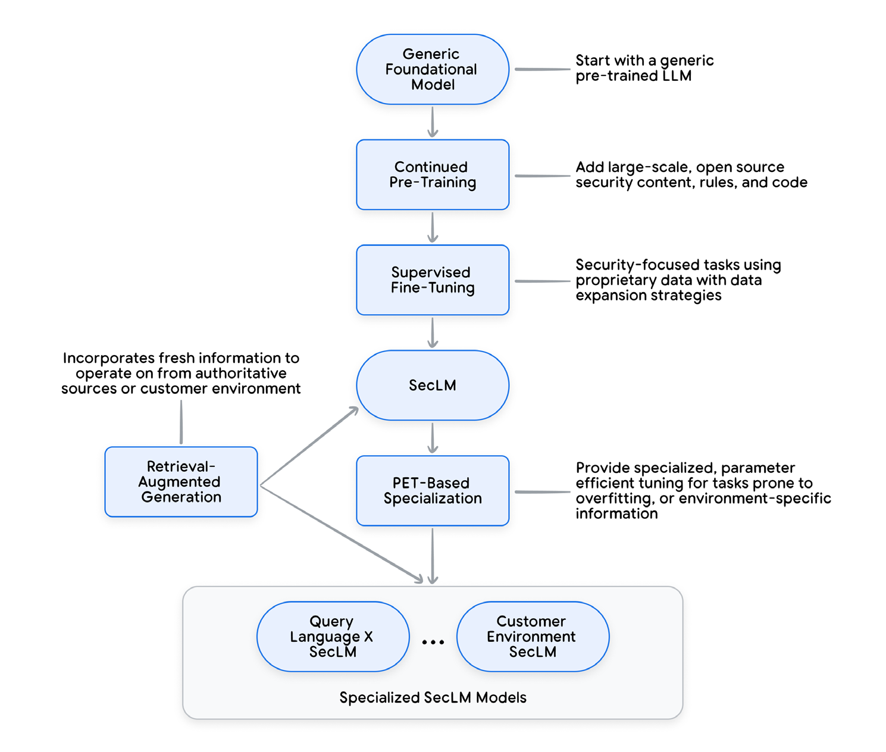
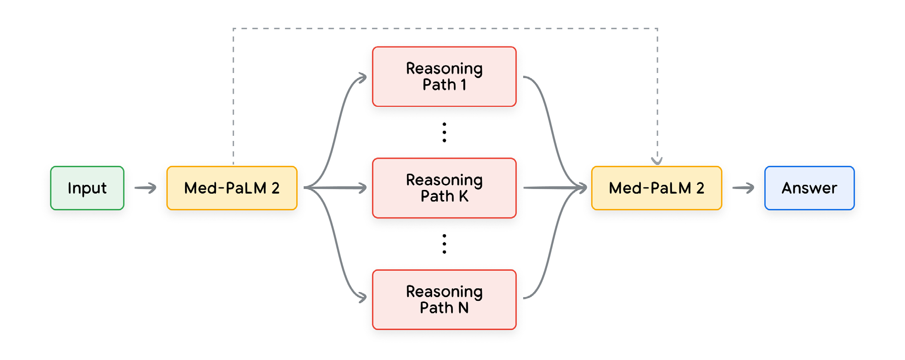

# SecLM and the Future of Cybersecurity

Specialized Generative AI (Gen AI) can help address these challenges by automating repetitive tasks, freeing up time for more strategic activities, and providing new opportunities to access knowledge.

## Challenges in cybersecurity

Three major challenges in security industry:
1. Threats - The threat landscape is constantly changing, with new and increasingly sophisticated attacks emerging all the time.
2. Toil - People working in security operations or DevOps roles often spend a significant amount of time on repetitive manual tasks that could be automated or assisted.
3. Talent - There is a shortage of skilled security professionals, making it difficult for organizations to find the people they need to protect their data and systems.

## How GenAI can tackle the challenges in cybersecurity

**Vision:** novices and security experts alike are paired with AI expertise to free themselves from repetition and toil, accomplish tasks that seem impossible to us today, and provide new opportunities to share knowledge.

**Multi-layered Approach:**

- **Top Layer:** existing security tools that understand the relevant context and data, and can actuate necessary changes.
- **Middle Layer:** a security-specialized model API with advanced reasoning and planning capabilities.
- **Bottom Layer:** datastores of authoritative security intelligence and operational expertise

Assisting human analysts or autonomous agents with LLMs by:

- **combining relevant context and authoritative sources with a flexible planning framework in a single API, which we call SecLM.**
- This API offers rich planning capabilities that combine LLMs and other ML models, Retrieval- Augmented Generation (RAG) to ground results in authoritative data, and tool use to perform actions or look up relevant information.

## SecLM: An API for cybersecurity tasks

In order to achieve this in a coherent and seamless manner, it is important to have a well-designed API that interacts with LLMs and traditional ML models, the user’s data, and other services to accurately complete the task at hand.

**Key Requirements:**

1. Freshness: access the latest threat and vulnerability data, which changes on a daily basis.
2. User-specific data: operate on the user’s own security data within the user’s environment without the risk of exposing that sensitive data to others or the infrastructure provider.
3. Security Expertise: understand high-level security concepts and terminology, and break them into manageable pieces that are useful when solving the problem
4. User-specific data: reason about the provided security data in a multi-step fashion by combining different data sources, techniques, and specialized models to solve security problems.

## Security-focused large language models

**Drawback: **applying LLMs to security is that general-purpose models didn’t peform as well as we needed on some security tasks.

**Reasons:**

1. Lack of publicly available security data
2. Limited depth of security content
3. Sensitive use cases

**Key Notes:**
- Careful when training models
- Training data only contains a fraction of eventual targets of the users
- Without careful curation, inadvertently can eliminate ability of model to generalize to new task.
- Proprietary and sensitive data should not be included in training.
- Instead the above data should be incorporated into a specialised derivative model that does not degrade the overall performance of the core security-specialized model.

**Training Process In Figure Below:**

# MedLM and the Future of Health Tech

## The potential for GenAI in medical Q&A

Medical question-answering (QA) has always been a grand challenge in artificial intelligence (AI).

**Difficulty:** Vast and ever-evolving nature of medical knowledge

**Now:** LLMs are able to understand and apply complex medical concepts in a way that was not possible for previous generations of AI systems.

This combination of technical capabilities and data availability provides the groundwork for models like Med-PaLM, an LLM aligned and fine-tuned based on the PaLM family of models.

## The opportunities

- Empowering users to ask questions in the context of the medical history in their health record.
- Triaging of incoming messages to clinicians from patients.
- Enhancing the patient intake process by moving beyond a fixed set of questions and instead adapting based on the patient's responses.
- Implementing a technology that actively monitors patient-clinician conversations and provides actionable feedback to the clinician.
- Enabling clinicians to better tackle unfamiliar scenarios or diseases by providing an ondemand curbside consult or reference materials.

> Note: it is important to validate the safety and efficacy of such systems before their implementation in clinical practice.

## The Scientific Starting Point

- AI medical systems today produce structured outputs in the form of "yes" or "no" or in numerical outputs
- This output is inflexible and non-human centric.
- To create a more flexible and human centric AI system:
	- Incorporate wide range of experiences, perspectives and expertise
	- Data and algorithm should go hand in hand with language and interaction, empathy and compassion.
- Med-PaLM 2 achieves an accuracy of 86.5% on USMLE-style questions. (Model developed by Google)

## How to evaluate: quantitative and qualitative

Tackling USMLE-style questions has gained prominence as a widely acceptable and challenging benchmark for evaluating medical question answering performance.

As every clinician will attest to, merely passing the USMLE does not indicate proficiency in diagnosing or managing patients clinically.

Nevertheless, USMLE serves as a useful benchmark since the answer is typically documented and evaluation can be conducted programmatically at scale.

**The human evaluation for Med-PaLM follows this procedure:**

- Each question is presented to both Med-PaLM and a board-certified physician.
- Both Med-PaLM and the physician independently provide their answers.
- Those answers are then presented in a blinded way (i.e., who provided each answer is not indicated) to separate raters.
- Additionally, direct side-by-side comparisons were conducted, such as determining which answer is better between A and B (where A and B are blinded and could refer to physician provided or outputs from different AI models).

## Evaluation in Real Clinical Environment

One of the main insights learned is that achieving high performance on retrospective datasets does not automatically translate into clinical performance.

It is imperative to carefully validate AI solutions in real-world environments in a meticulous manner to ensure their robustness and reliability.

**It is encouraged to adhere to these scientific steps:**

- Retrospective evaluation
- Prospective observational (non-interventional)
- Prospective interventional

End-to-end assessment is essential for understanding the role and benefit of the technology and tailoring AI solutions to meet the needs effectively.

## Training strategies for Med-PaLM 2

To tailor Med- PaLM 2 for medical applications, instruction fine-tuning7 was performed using MultiMedQA,7 including the following datasets:
- MedQA,
- MedMCQA,
- HealthSearchQA,
- LiveQA,
- MedicationQA

To enhance the specialized variant of Med-PaLM 2 focusing on multiple-choice questions, a range of prompting strategies including few-shot prompting, chain-of-thought (CoT) prompting, and self-consistency were employed.

Ensemble refinement (ER), which builds on other techniques that involve conditioning an LLM on its own generations before producing a final answer:

- multiple possible explanations and answers are stochastically generated via temperature sampling.
- model is conditioned on the original prompt, question, and generated contents from the first stage, for a more refined answer.

For the foreseeable future, it is reasonable to assume that models customized for specific applications or domains will yield better results, and we are tracking trends and any convergence in performance between general and specific models in the years ahead.