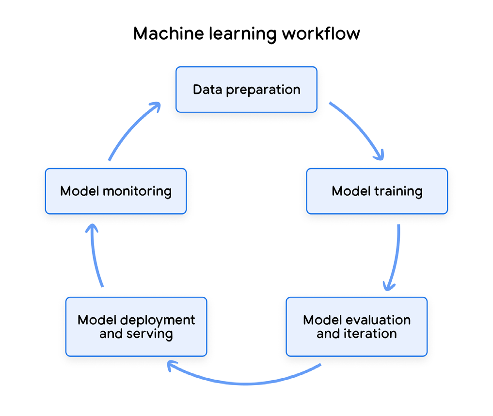
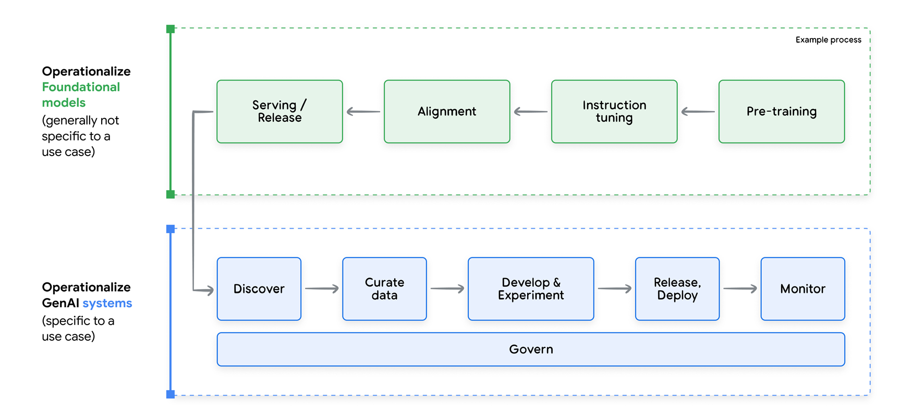
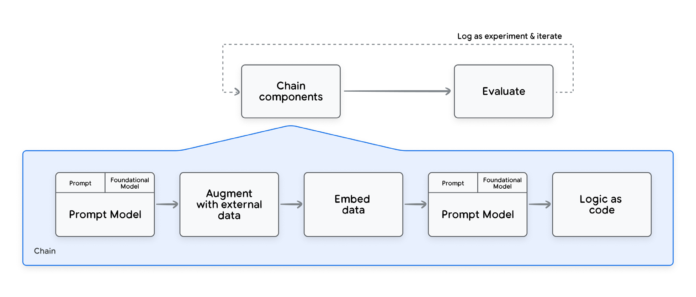
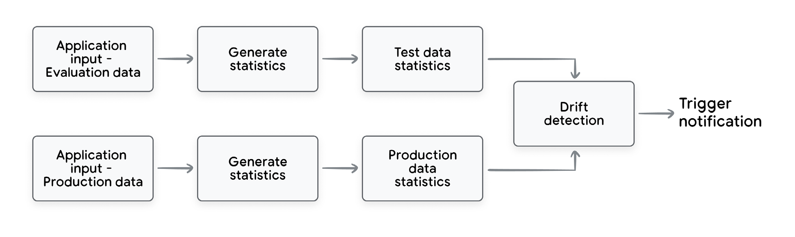
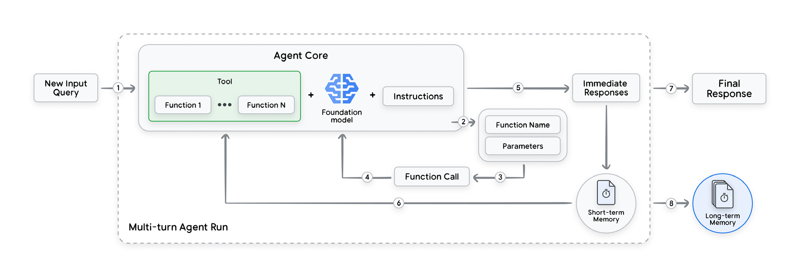

# Introduction
## What are DevOps and MLOps?

DevOps is a software engineering methodology that aims to bridge the gap between development (Dev) and operations (Ops). It promotes collaboration, automation, and continuous improvement to streamline the software development lifecycle, introducing practices such as continuous integration and continuous delivery.

MLOps builds upon DevOps principles to address the unique challenges of operationalizing Machine Learning systems rapidly and reliably. In particular, MLOps tackles the experimental nature of ML through practices like:

- Data validation: Ensuring the quality and integrity of training data.
- Model evaluation: Rigorously assessing model performance with appropriate metrics.
- Model monitoring: Tracking model behavior in production to detect and mitigate drift.
- Tracking & reproducibility: Maintaining meticulous records for experiment tracking and result reproduction.

## Lifecycle of a gen AI system

1. **Discovery phase** - Identify most suitable model
2. **Development and experimentation** - prompt engineering, few-shot learning, PEFT, model chaining
3. **Data engineering practices** - Tuning data is often needed to adapt models to specific tasks, styles, or to rectify persistent errors.
4. **Deployment** - Management of many new artifacts in the deployment process, including prompt templates, chain definitions, embedding models, retrieval data stores, and fine-tuned model adapters among others.
5. **Continuous monitoring** - ensuring safety standards, fairness, transparency and accountability
6. **Continuous Improvement** - constantly tweaking these foundational models (FMs)

# The core component of LLM Systems: A prompted model component

Neither the model nor the prompt is sufficient for the generation of content; gen AI needs the combination of both.

Prompt engineering involves two iterative steps:
1. Prompting
2. Evaluation

Prompts can include anything from context, instructions, examples, guardrails to actual internal or external data pulled from somewhere else. So, are prompts data? Are they code? To address these questions, a hybrid approach is needed:

- Prompt as Data: Some parts of the prompt will act just like data. Elements like few-shot examples, knowledge bases, and user queries are essentially data points.
- Prompt as Code: Other components such as context, prompt templates, guardrails are mode code-like.

As a result, when applying MLOps practices to gen AI, it becomes important to have in place processes that give developers easy storage, retrieval, tracking, and modification of prompts.

## Chain & Augment

Leveraging a divide and conquer approach, several prompted models can be connected together, along with calls to external APIs and logic expressed as code.

A sequence of prompted model components connected together in this way is commonly known as a chain.

## Tuning and Training

To improve task performance practitioners often also need to fine-tune the model directly. Fine-tuning lets you actively change the layers or a subset of layers of the LLM to optimize the capability of the model to perform a certain task.

Two common ways:
1. Supervised Fine-tuning
2. RLHF

From MLOps Lens:
1. The capability to track artifacts being part of the tuning job.
2. The capability to measure the impact of the tuning.

## Continous Training and Tuning

In machine learning operations (MLOps), continuous training is the practice of repeatedly retraining machine learning models in a production environment.

For gen AI models, continuous tuning of the models is often more practical than retraining from scratch due to the high data and computational costs involved.

Cost is major consideration.

To manage costs, techniques like model quantization can be applied. This represents model weights and activations using lower-precision 8-bit integers rather than 32-bit floats, which reduces computational and memory requirements.

## Data Practices

Data Types:

- Conditioning prompts
- Few-shot examples
- Grounding/augmentation data
- Task-specific datasets
- Human preference datasets
- Full pre training corpora

Each data type needs careful organization and maintenance. We need to ensure reproducibility, adaptability, governance, and continuous improvement using all the data required in an application as a whole but also individually.

Here are few ways to leverage large models for data engineering purposes:
- Synthetic data generation
- Synthetic data correction
- Synthetic data augmentation

## Evaluation

**Automation:**
- Fast: Instead of spending time manually checking each test case, you can let the machines do the heavy lifting.
- Automation makes evaluation more reliable: takes human subjectivity out of the equation

**Challenges:**
- Both the inputs (prompts) and outputs can be incredibly complex.
- Outputs themselves are often high-dimensional
- Lack of ground truth data is another common hurdle (One solution is synthetic data generation)
- Comprehensive evaluation is essential for safeguarding gen AI applications against adversarial attacks. Malicious actors can craft prompts to try to extract sensitive information or manipulate the model's outputs.

**Metric:**
- Established metrics: BLEU for translation and ROUGE for summaries
- Custom evaluation: Use a foundational model as a judge

# Deploy

Two main types of deployment:

1. Deployment of gen AI systems: This focuses on operationalizing a complete system tailored for a specific use case.
2. Deployment of foundational models: This applies to open-weight models, where the model weights are publicly available on platforms like Vertex Model Garden or Hugging Face, or privately trained models.

## Compression and Optimization

- Addressing the infrastructure issue is to optimize the model itself.

### Techniques:

1. **Quantization** reduces the size and computational requirements of the model by converting its weights and activations from higher-precision floating-point numbers to lower-precision representations, such as 8-bit integers or 16-bit floating-point numbers.
2. **Model Pruning** is a technique for eliminating unnecessary weight parameters or by selecting only important subnetworks within the model. This reduces model size while maintaining accuracy as high as possible.
3. **Distillation** trains a smaller model, using the responses generated by a larger LLM, to reproduce the output of the larger LLM for a specific domain. This can significantly reduce the amount of training data, compute, and storage resources needed for the application.

## Logging and Monitoring

- **Logging** is necessary for applying monitoring and debugging on your gen AI system **in production.**
- **Monitoring** is done **at application level** to prove that application is performant and so are the components.
- **Skew detection** refers to training-serving skew that occurs when the feature data distribution in production deviates from the feature data distribution observed during model training. 
- In the case of Gen AI systems using pretrained models in components chained together to produce the output.
- We can measure skew by comparing the distribution of the input data we used to evaluate our application and the distribution of the inputs to our application in production.
- The **drift detection** process checks for statistical differences between two datasets.
- **Continuous evaluation** is another common approach to GenAI application monitoring.
- In a **continuous evaluation** system, you capture the model's production output and run an evaluation task using that output, to keep track of the model's performance over time.
- An alerting process should be deployed for notifying application owners when a drift, skew or performance decay from evaluation tasks is detected.

# Extend MLOps for GenAI to Agents

**Recap Agent definition:** These intelligent systems, capable of interacting with their environment/tools and making decisions, represent a significant advancement in genAI capabilities.

Steps:
- New Query
- Function identification
- Function call preparation
- Function call execution
- Intermediate Response
- Iterative Context Update (Short-Term Memory)
- Final response

## Tool Orchestration

- Tools are essential for enabling generative AI agents to interact with the world and execute complex tasks.

## Tool Types and Environments:

- Code Functions
- Private REST APIs
- Public REST APIs

## Tool Registry

A Tool Registry, a centralized catalog of all available tools, provides a standardized way to discover, access, and manage these essential components.

**Key Advantages:**

- Reusability
- Shareability and visibility
- Security and accessibility
- Standardization
- Robustness
- Auditability

The Tool Registry stores essential information about each tool, including its name, description, parameters, and output format, effectively serving as a comprehensive tool catalog.

## Observability and Memory

- Observability refers to the ability to gain insights into an agent's internal workings and its interactions with the environment.
- Explainability, on the other hand, focuses on understanding the why behind an agent's decisions—why it selected a particular tool or took a specific action.

The agent's short-term and long-term memory play a crucial role in providing context and enabling traceability.

Short-term memory (or conversation history) stores the ongoing conversation within a single user session.

Implementation Options:
- Logs
- Cloud Storage/Database
- API Session
- Combination

Long-term memory, on the other hand, stores information about past user interactions across multiple sessions.

Implementation Options:
- Vector Databases
- Metadata Storage/Graphs
- Cloud Storage/Databases
- Combination

## Deploy Agent to Production

Deploying an agent to production requires a robust and automated process to ensure consistency, reliability, and scalability.

Process Pipeline: 
 - Validation of structure of repository
 - Deploy agent to development environment (IaC for early testing and integration)
 - Manual approval for human oversight
 - Deploy agent to staging environment
 - Human testers engagement at scale
 - Deploy agent to production environment
 - Post-deployment, continuous monitoring done by predefined scripts and configs

This entire deployment lifecycle, from initial development to production deployment and monitoring, forms a continuous loop of improvement.

